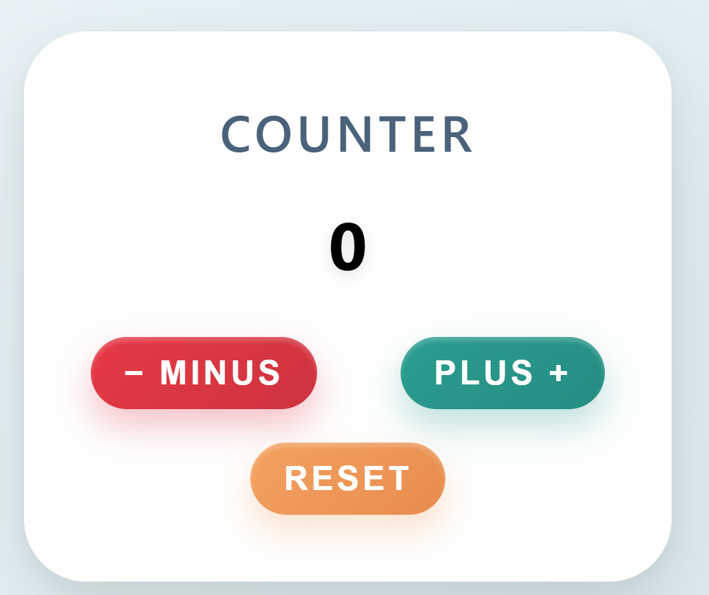

# 🚀 Counter App — Educational Project for Beginners  

  
*A simple counter app with beautiful styles and animations*  

## 🌟 About the project  
This project is the perfect starting point for beginners learning **React**. You will learn how to manage state, handle events, and style components. The app includes **responsive design**, animations, and smooth effects.  

🔗 **Project Demo:** [Counter App](https://your-link.vercel.app)  

---

## 📚 What you will learn:  
✅ How to set up a React project from scratch  
✅ How to use `useState` for state management  
✅ How to add styles and animations to buttons  
✅ How to deploy the project to GitHub Pages or Vercel  

---

## ⚙️ Technologies  
- **React** — state management and components  
- **CSS** — styling (gradients, shadows, animations)  
- **Git/GitHub** — version control and publishing  

---

## 🚀 How to Run the Project  

1️⃣ Install [Node.js](https://nodejs.org/) (if not installed yet).  
2️⃣ Clone the repository:  
   ```bash
   git clone https://github.com/your-account/counter-app.git
   cd counter-app
   npm install

